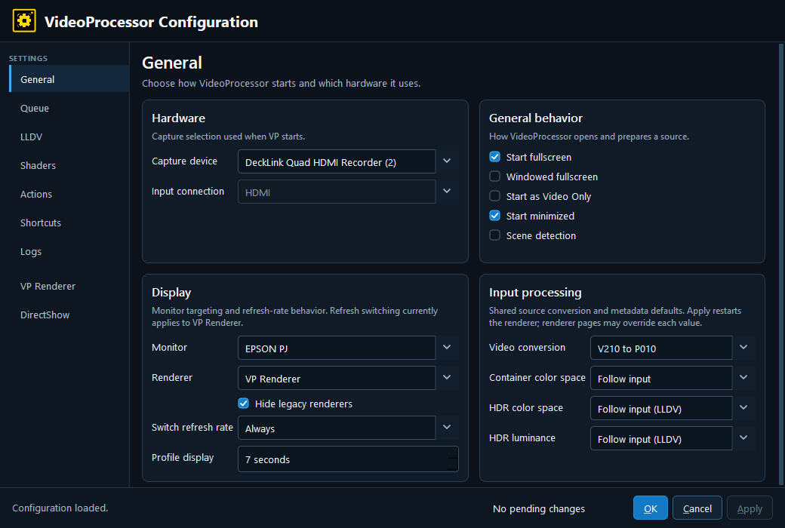
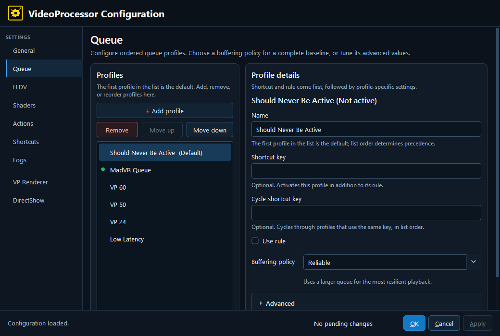
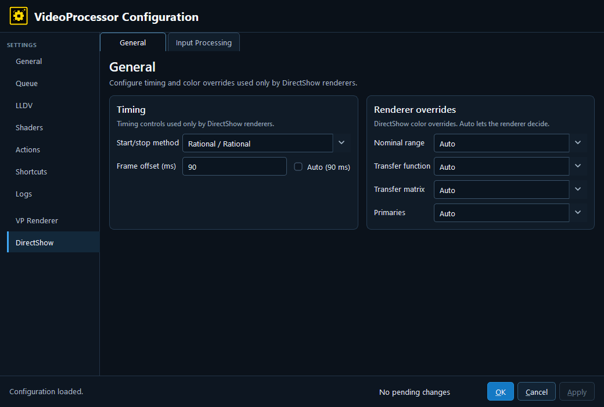
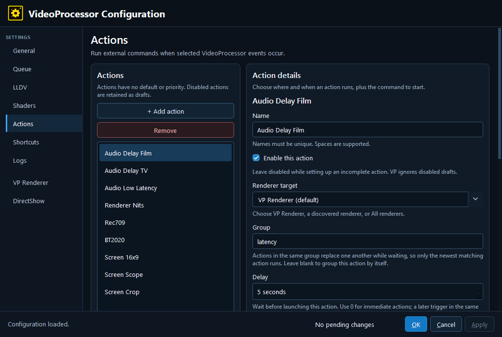
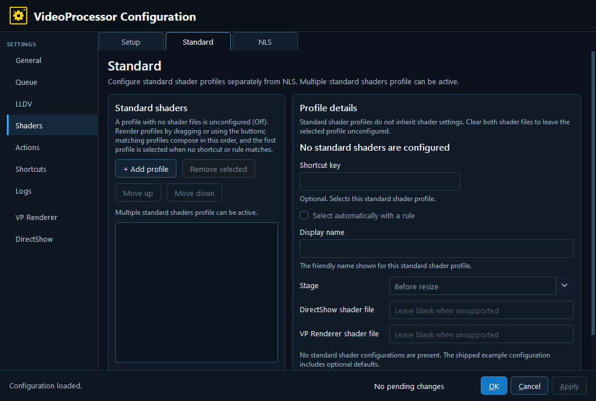
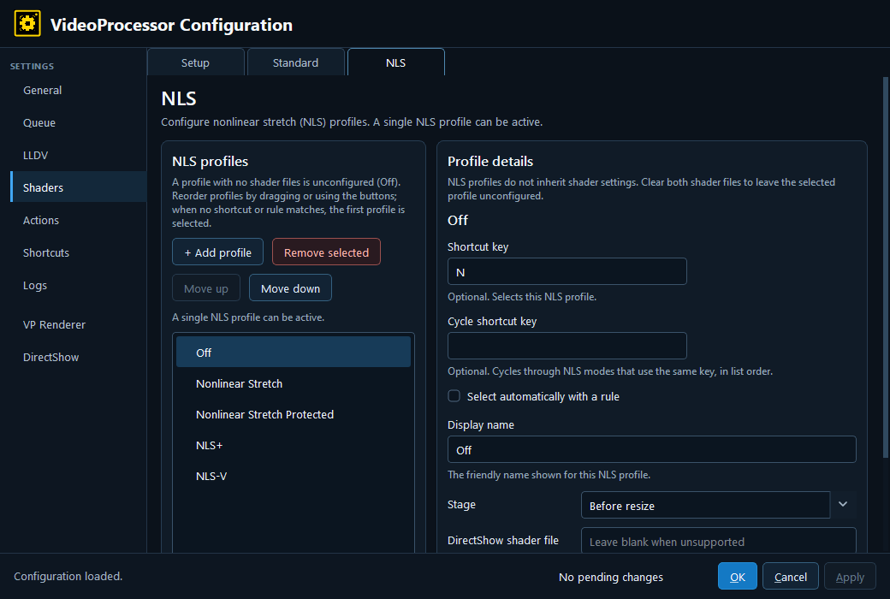
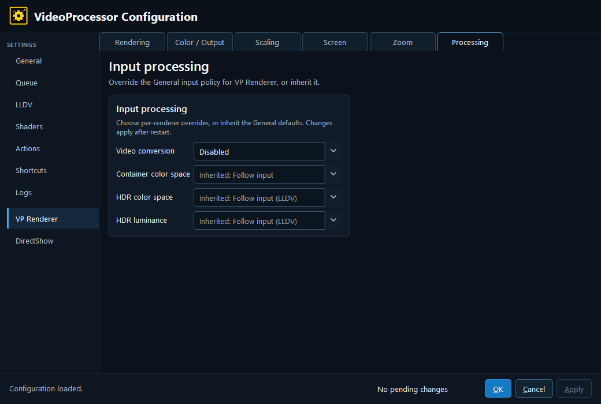
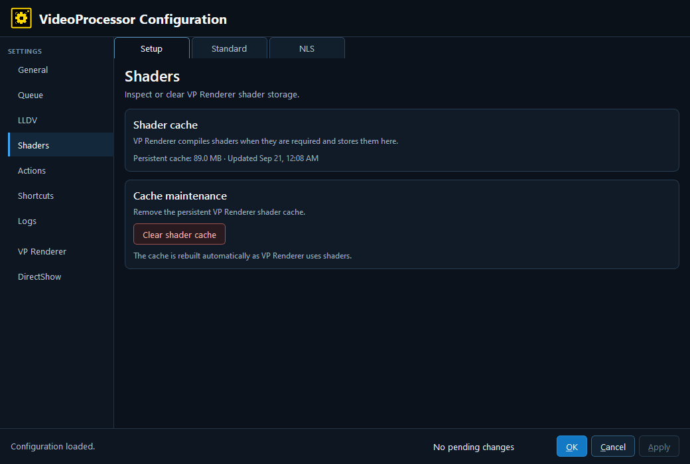
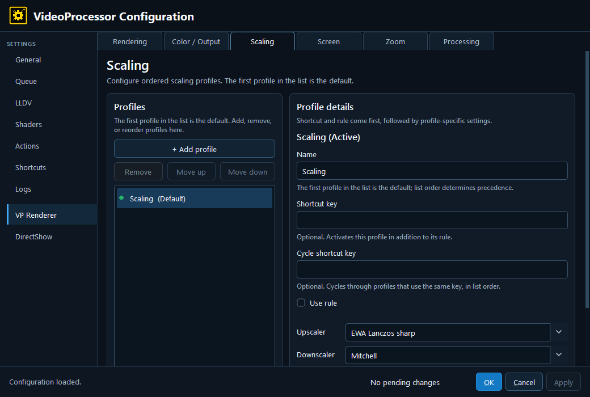
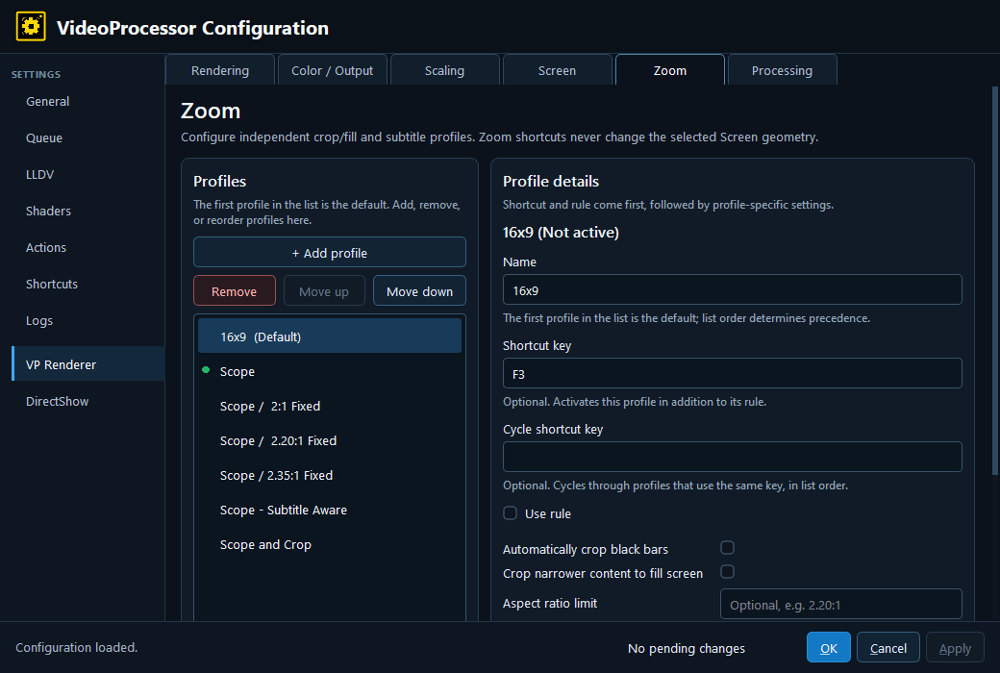

# VideoProcessor Configuration Guide (first draft)

> Draft status: first-pass documentation for review. The screenshots are real captures from the deployed VideoProcessor configuration editor. They show the UI as it was available during capture, including local device, monitor, renderer, and profile names.

This guide explains the configuration editor screen by screen and tab by tab. It is written for an operator who wants to understand what a setting does before changing it, rather than for someone editing the `.cfg` file by hand.

## Before you begin

### Save and apply

The editor changes the configuration document in memory as controls are edited. **OK** saves and closes, **Cancel** discards the in-memory edits, and **Apply** saves without closing. Apply may restart or reinitialize capture/renderer state for settings that cannot be changed live; each screen calls that out where it matters. The footer reports whether changes are pending.

### Profiles, order, inheritance, and rules

Several screens are profile editors. They share the same model:

- The first profile is the default and profile order is significant.
- **+ Add profile** creates another profile. **Remove** deletes the selected profile. **Move up** and **Move down** change precedence.
- **Name** is the human-readable profile name.
- **Shortcut key** selects one profile directly.
- **Cycle shortcut key** cycles through profiles that share that key, in list order.
- **Use rule** enables the rule field. A rule selects a profile from source metadata such as width, height, or transfer function.
- A blank or **Inherited / not set** value means “use the parent/default value” where inheritance is supported. An explicit value creates an override.
- A green marker and an **Active** title identify the profile currently selected by the running configuration snapshot; **Not active** means the profile is configured but not currently selected.

Rules use the expression language described in the [Rules](#rules) section. For example, `${width} >= 1920 && ${eotf} == "HDR"` selects a profile for large HDR sources. Shortcut and rule are independent selectors: either can select a profile, and both may be configured.

## Rules

Rules let VP choose a profile automatically or decide whether an action should run. A rule reads the current state; it does not edit the configuration and it is not evaluated for every video frame.

### How profile rules work

The **Rule** field appears after **Use rule** is enabled on profile screens. It applies only to the profile group that contains it.

- Each profile group is independent. Selecting a Queue profile does not select a Color / Output, Screen, Zoom, or shader profile.
- For single-selection groups, the first profile is the default. VP checks later profiles in list order and uses the first one whose rule matches. If none matches, the default remains selected. NLS follows this first-match behavior.
- Standard shaders are the exception: every matching shader profile can be active, and matching shaders compose in list order.
- A profile can inherit settings that it does not define from the group's default profile. The rule selects the profile; it does not merge unrelated groups.
- A shortcut and a rule are alternatives for the same profile. Either one can select it. A manual shortcut selection takes precedence for that group until another profile, the default/reset selection, or normal automatic selection replaces it.
- Source-based rules are reevaluated when the relevant source, renderer, profile, or display state changes. They are not a per-frame scene detector.

### Operators and value types

Use the documented variable form `${name}`. Text values go in quotes; numbers and Boolean values do not.

| Value type | Operators and examples | Meaning |
| --- | --- | --- |
| Text | `${eotf} == "HDR"` or `${format} != "P010"` | Text comparisons use `==` or `!=`. Text matching is case-insensitive, except for keyboard shortcuts. |
| Number | `${width} >= 1920`, `${cadence} < 30`, `${cadence} == 23.976-24` | Numeric comparisons support `==`, `!=`, `<`, `<=`, `>`, and `>=`. A numeric range with `==` or `!=` is inclusive. Fractions such as `24000/1001` are valid numeric values. |
| Boolean | `${hdr_metadata}`, `!${interlaced}`, or `${hdr_metadata} == false` | A Boolean can stand alone, be negated with `!`, or be compared with `true` or `false`. |
| Keyboard shortcut | `${key} == "F5"` | `${key}` is for manual profile selection only. It must compare one non-empty, quoted shortcut. Shortcut spelling is case-sensitive. |

Combine complete comparisons with:

- `&&` — both conditions must be true.
- `||` — either condition may be true.
- `!` — reverses the following condition.
- Parentheses — make grouping explicit. `!` binds most tightly, then `&&`, then `||`; parentheses are recommended for anything more complex than a short condition.

Use `==`, not a single `=`. Use `||`, not a single `|`, when combining alternatives.

### Variables available in profile rules

These are the variables accepted by the Rule field on profile-based screens, including Queue, Rendering, Color / Output, Scaling, Screen, Zoom, LLDV, and shader profiles.

| Type | Variables | What the value describes |
| --- | --- | --- |
| Text | `eotf`, `transfer` | The source transfer/brightness encoding, such as `SDR`, `HDR`, `PQ`, or `HLG`. |
| Text | `colorspace`, `primaries` | The source color system or primary-color set, such as `Rec709`, `BT2020`, or `P3`. |
| Text | `format` | The source pixel format, such as `P010` or another format reported by the capture path. |
| Text | `scan` | Whether the source is `progressive` or `interlaced`. |
| Text | `resolution` | The source dimensions in `widthxheight` form, such as `1920x1080`. |
| Text | `renderer` | The active renderer name as shown in the renderer selector. |
| Boolean | `hdr_metadata` | Whether usable HDR metadata is present for the source. |
| Boolean | `interlaced` | Whether the source is interlaced. This is the Boolean counterpart to `scan`. |
| Number | `source_rate` | The source rate rounded down to a whole number, such as `23`, `29`, or `59`. |
| Number | `cadence` | The more precise source/display cadence, such as `23.976` or `59.94`. |
| Number | `width`, `height` | Source width and height in pixels. |
| Number | `actual_refresh` | The active Windows display refresh rate in Hz. |
| Manual selector | `key` | A registered keyboard shortcut used to select or reset a profile manually. |

Use the value VP reports for the current source. For example:

```text
${eotf} == "PQ" && ${colorspace} == "BT2020"
${width} >= 1920 && ${height} >= 1080
${scan} == "interlaced" || ${interlaced}
${cadence} == 24000/1001
```

### Variables available in Actions

The **Only run when** field on an Action is a different kind of rule. The Action's **On** event determines when VP takes a snapshot; the condition then filters that event. It is evaluated at the event boundary, not continuously.

The following variables are available for Action conditions:

| Context | Variables | Use |
| --- | --- | --- |
| Event identity | `event`, `event_reason` | Identify the event being handled and why it occurred. For example, `${event_reason} == "source"`. `event_reason` can be `manual`, `source`, `renderer_ready`, or `refresh`. |
| Refresh events | `actual_refresh`, `requested_refresh`, `previous_refresh` | Compare the refresh rate that is active, requested, or being left. These are available for `refresh.applied`, `refresh.confirmed`, and `refresh.restored`. |
| Current source state | `eotf`, `transfer`, `colorspace`, `primaries`, `format`, `scan`, `resolution`, `hdr_metadata`, `interlaced`, `source_rate`, `cadence`, `width`, `height` | Test the source state at a source, profile, renderer, or committed-state event. |
| Current profile selection | `profile.input`, `profile.scaling`, `profile.display`, `profile.color`, `profile.output`, `profile.viewport`, `profile.zoom`, `profile.queue`, `profile.lldv`, `profile.nls`, `profile.standard_shaders` | Test which profile is active in a group. The value is the profile's stable name; the UI label is also accepted for profile comparisons. |
| Current profile labels | `profile.viewport_name`, `profile.zoom_name`, `screen_config`, `zoom_config` | Test the visible label for the selected Screen or Zoom profile. |
| Current presentation state | `vertical_alignment`, `screen_aspect`, `anamorphic_scale`, `automatic_crop`, `subtitle_fit` | Test the active screen geometry and crop/subtitle behavior. |
| Current HDR/subtitle policy | `hdr_peak_analysis_height_percent`, `hdr_peak_analysis_picture_only`, `hdr_peak_analysis_motion_compensation`, `subtitle_hold_seconds`, `subtitle_engage_drift_ms`, `subtitle_release_drift_ms`, `subtitle_padding_pixels`, `subtitle_target_buffer_pixels` | Test the active HDR-analysis or subtitle-placement settings. |
| Viewport state | `viewport_generation` | Identify the current viewport-generation number when diagnosing transitions. |
| Previous state | `previous.<variable>` and `previous_profile.<group>` | Compare the state being left with the new state. For example, `${previous_profile.viewport} == "scope" && ${profile.viewport} == "base"`. |

An Action with more than one event must use variables that are available for every event named in **On**. If a condition mixes refresh-only variables with source/profile events, VP rejects the Action; split it into separate Actions instead.

`renderer` and `key` are useful in profile-selection rules but are not Action snapshot variables. `previous_profile.<group>` uses the same group names as `profile.<group>`; it does not mean the previous display label.

### Useful rule examples

```text
${eotf} == "HDR" && ${width} >= 1920

${interlaced} && ${height} >= 720

${event} == "profile.color.changed" && ${profile.color} == "bt2020"

${previous_profile.viewport} == "scope" && ${profile.viewport} == "base"
```

If a rule does not match, first check the variable spelling, the value shown by the active profile/source, and the profile order. For Actions, also check that the variables are valid for every event in **On**.

### Rendering concepts in plain language

Several VP Renderer settings use the same ideas described in libplacebo's user-facing options guide. The short explanations below are intended to make the controls understandable without requiring graphics or rendering knowledge:

- **Tone mapping** adapts brightness between the source and display. For example, it can fit bright HDR highlights into a display with a lower peak brightness while trying to preserve visible detail. Different curves make different trade-offs in highlight detail, shadow detail, and average picture brightness.
- **Gamut mapping** handles colors that the destination display cannot reproduce. Instead of simply cutting those colors off, a mapping method can compress saturation, shift hues, or preserve brightness according to its policy. Tone mapping can create additional out-of-gamut colors, so the two operations are related.
- **Peak detection** estimates how bright the current HDR content actually is. That estimate lets the renderer adapt to scene or frame changes instead of treating every source as if it had the same brightness.
- **Contrast recovery** restores some high-frequency detail after tone mapping. It can make the result look crisper, but too much can create ringing or halos.
- **Debanding** reduces visible steps in smooth gradients. It is most useful when the source already contains quantization or compression banding, and it costs additional processing time.
- **Dithering** adds carefully controlled variation before a picture is reduced to a lower output precision. This hides quantization patterns and usually looks smoother than rounding every pixel the same way.
- **Scaling** reconstructs the image when its size changes. An upscaler enlarges an image, a downscaler reduces it, and anti-ringing limits bright or dark halos around sharp edges.

These concepts explain what the controls are trying to achieve; the VP editor's labels, available choices, defaults, and profile rules determine what is actually applied on this installation. VP's bundled renderer is based on libplacebo 7.360.1 and also includes VP-specific behavior such as analysis-crop and D3D11 timing controls. Do not assume that a similarly named control behaves exactly like a standalone libplacebo application.

For technical background, see the [libplacebo options guide](https://github.com/haasn/libplacebo/blob/master/docs/options.md) and [project overview](https://github.com/haasn/libplacebo). These are background references, not configuration steps for VP.

## How the configuration editor is organized

The editor groups related settings under a small number of navigation headings. Use this as a quick orientation; the sections that follow explain each screen in detail and show the corresponding UI capture in context.

- **General** — Startup behavior, capture hardware, display selection, and shared input metadata defaults.
- **Queue** — Ordered frame-queue profiles and buffering policy.
- **LLDV** — Ordered Low-Latency Dolby Vision metadata profiles shared by the renderer paths.
- **Shaders** — Shader cache maintenance, standard shader profiles, and nonlinear-stretch (NLS) profiles.
- **Actions** — External commands triggered by VideoProcessor events.
- **Shortcuts** — Global/application shortcuts and shortcut-focus behavior.
- **Logs** — Log enablement, enhanced diagnostics, retention, and access to log files.
- **VP Renderer** — Rendering quality and HDR mapping; Color / Output calibration and transport; scaling; screen geometry; zoom/crop behavior; and renderer-specific input processing.
- **DirectShow** — DirectShow timing/color overrides and DirectShow-specific input processing.

The **VP Renderer** and **DirectShow** headings contain tabs. The **Shaders** and **Shortcuts** headings do as well. A screen may contain collapsible groups or controls below the initial view, so the screenshot at the start of each section is an orientation point rather than a complete inventory of everything on that page.

For the current origin beta tip, [`v1.3.005-beta`](https://github.com/billslack2/videoprocessor/commit/38477f13560a3c4f0085c8840127ae064d0a5b86), the VP Renderer tabs are **Rendering**, **Color / Output**, **Scaling**, **Screen**, **Zoom**, and **Processing**. The former Output page index redirects to **Color / Output**. This guide follows that current beta navigation and the real screenshot so readers can match the shipped UI.

---

## 1. General



The General screen establishes the machine-wide starting point. It has four cards: Hardware, General behavior, Display, and Input processing.

### Hardware

- **Capture device** — Selects the capture device VideoProcessor opens. The list is populated from devices discovered on this PC. If a saved device is no longer present, choose a replacement rather than leaving an unavailable entry.
- **Input connection** — Selects the physical input exposed by the chosen capture device. If the device exposes only one input, the editor may show a device default or explanatory message.

### General behavior

- **Start fullscreen** — Starts the presentation window in fullscreen mode.
- **Windowed fullscreen** — Uses a borderless window that covers the monitor instead of an exclusive fullscreen mode. This is often friendlier to desktop composition and multi-monitor workflows.
- **Start as Video Only** — Starts without the normal control UI. This is the `noui` behavior; the configuration editor and keyboard shortcuts remain the way to control the session.
- **Start minimized** — Starts VP minimized.
- **Scene detection** — Enables the scene-detection policy used by VP for source changes. The current editor exposes this as a supported on/off choice rather than a menu of algorithms.

### Display

- **Monitor** — Chooses the display used for fullscreen presentation. **Default monitor** lets Windows/VP choose the normal default.
- **Renderer** — Selects the active renderer. The list is discovered on the current PC and may include VP Renderer, DirectShow renderers, and installed legacy renderers.
- **Hide legacy renderers** — Removes older renderer entries from the selection list. It does not uninstall them; it only keeps the editor and runtime profile choices focused on current renderers.
- **Switch refresh rate** — Controls when VP asks Windows to switch the display refresh rate: **Never**, **Full Screen Only**, or **Always**.
- **Profile display** — Sets how long a profile-change notification remains visible. **Off** disables the display; otherwise the value is in seconds.

### Input processing

- **Video conversion** — Selects a source conversion. **Disabled** leaves the source format alone; **V210 to P010** converts V210 input to P010 for a renderer path that expects it.
- **Container color space** — Supplies a container-level color-space hint when one is available. **Follow input** preserves the source/device description.
- **HDR color space** — Chooses whether HDR color information follows the input, follows LLDV metadata, follows the container, or is forced to BT.2020, P3, or Rec.709.
- **HDR luminance** — Chooses whether HDR luminance follows the input, follows LLDV metadata, or uses user-supplied values. The user-value controls are part of the relevant HDR/profile workflow rather than this compact General card.

The General input choices are defaults. The VP Renderer and DirectShow **Input Processing** tabs can override them independently.

---

## 2. Queue



Queue is an ordered profile editor. It controls how many frames VP keeps available and how it recovers after a render restart or an unusually deep queue.

### Profile controls

Use the shared profile controls described above to create profiles for different capture or timing conditions. The queue profile may also be selected by shortcut or rule.

### Buffering policy

- **Buffering policy** — Applies a complete baseline such as a balanced or low-latency queue policy. Choose **Custom** when you want to tune individual values.
- **Queue depth** — Maximum nominal number of frames held by the queue.
- **Lead frames** — Frames kept ahead of the currently presented position. More lead can absorb timing variation; less lead reduces latency.
- **Startup pre-roll** — Frames accumulated before normal presentation begins.
- **Target frames** — The desired steady-state queue target.
- **Active-picture lookahead** — Extra frames inspected ahead of presentation for active-picture decisions.
- **Queue reset delay** — Delay, in seconds, before VP resets/rebuilds the queue after a renderer restart.
- **Queue recovery threshold** — Percentage threshold that determines when an oversized queue should be recovered. Values above 100% are valid because the full queue path can include work outside the nominal capacity.

Editing an advanced queue value changes the profile to **Custom**. Start from a policy and tune only the values you have a measured reason to change.

---

## 3. VP Renderer — Rendering


Rendering is a profile editor for the VP Renderer’s image-processing pipeline. It is intentionally separate from Color / Output: Rendering describes how source pixels are processed, while Color / Output describes the display calibration and transport target.

### Rendering quality

- **Rendering quality** — Selects the broad quality/performance preset: **High**, **Balanced**, or **Fast**. The preset can resolve several automatic choices below. The small status text under an **Auto** control is the effective choice after the preset and hardware are considered.

### Tone mapping

- **Target nits** — VP's target display peak/white policy in nits. It is the luminance target used when mapping HDR content to the configured display target; it is not a measurement of the current Windows HDR panel brightness.
- **HDR tone-map target black** — Target black level in nits. An explicit value is useful when the display’s black floor is known; **Auto** lets the profile use its normal default behavior.
- **Tone mapping** — Selects the HDR-to-target brightness curve, including black-point adaptation where applicable. **Auto** follows the selected quality preset and VP's normal behavior; the explicit choices include spline, BT.2390, ST 2094-40, and Reinhard in the current editor. Reinhard is retained for compatibility and is generally not the best choice for modern HDR.
- **Gamut mapping** — Handles colors outside the destination gamut, including colors made out of gamut by tone mapping. Perceptual and softclip preserve a more natural appearance than hard clipping; relative and desaturate are alternate policies for different calibration goals.
- **Peak detection** — Controls whether VP analyzes the picture to estimate scene or frame peaks. **High Quality**, **Standard**, **Off**, and **Auto** trade analysis cost, stability, and highlight adaptation. VP may rebuild this estimate after a source change or seek.
- **Contrast recovery (0 to 2)** — Separates high- and low-frequency components and adds part of the high-frequency component back after tone mapping. Zero disables it; larger values can restore perceived detail but may reveal ringing, with halos as a possible visual symptom.

Together, these settings determine how VP adapts the source to the display: tone mapping handles brightness, gamut mapping handles color range, and peak detection supplies information about the content being shown. The available choices and defaults come from the VP build and the selected profile.

### Processing

- **Debanding** — Reduces visible bands in smooth gradients. **Standard** and **Light** trade quality and GPU work; **Off** disables the pass.
- **Dithering** — Adds controlled noise or error diffusion before quantization to reduce banding. The editor exposes blue noise, ordered patterns, white noise, several error-diffusion kernels, **Auto**, and **Off**.
- **Display bit depth** — Chooses the precision target for the final rendered picture: **Auto**, **10-bit or higher**, or **8-bit**. This affects how VP prepares the signal and applies dithering; it is not a guarantee that Windows, the cable, or the panel is operating at that depth.

### Calibration ownership

The current beta keeps display calibration and calibration LUT controls on **Color / Output**, not on Rendering. Rendering retains the HDR target luminance/black policy, quality preset, tone mapping, gamut mapping, peak detection, debanding, dithering, and display-bit-depth controls. See section 14 for the calibration method, target gamut, gamma, LUT slots, and output transport.

---

## 4. DirectShow — General



This screen affects DirectShow renderers only. It contains Timing and Renderer overrides cards.

### Timing

- **Start/stop method** — Selects the clock/theoretical timing pair used when a DirectShow renderer starts and stops presentation. The choices include Clock Smart, Clock Smart 2, Rational / Rational, Clock / Rational, Clock / Theoretical, Clock / Clock, Theoretical / Theoretical, Clock / None, Theoretical / None, and None.
- **Frame offset (ms)** — Applies a timing offset in milliseconds. **Auto** inherits the shared/default frame-offset behavior; clearing Auto enables an explicit value.

These are synchronization controls. Change them only when measurements or a renderer-specific compatibility requirement show that the default timing method is wrong.

### Renderer overrides

- **Nominal range** — Declares the expected code range: Auto, Full, Limited, or Small.
- **Transfer function** — Declares the source transfer function, including PQ, Rec.709, BT.2020 constant-luminance variants, common gamma values, linear RGB, log encodings, and HLG.
- **Transfer matrix** — Declares the YUV/RGB conversion matrix, such as BT.2020, BT.709, BT.601, 240M, FCC, or YCgCo.
- **Primaries** — Declares the source primaries, including BT.2020, DCI-P3, BT.709, NTSC variants, CIE 1931, or ACES.

**Auto** is the safest choice when the source metadata is trustworthy and the renderer handles it correctly. An explicit override is for known-bad or incomplete source metadata.

---

## 5. VP Renderer — Screen


Screen profiles describe the physical presentation geometry and screen-relative behavior. Screen selection is independent from Zoom selection.

### Screen geometry

- **Screen aspect ratio** — Declares the target screen shape. Enter a ratio such as `16:9`, `32:15`, or a pixel-style ratio such as `2100x1000`.
- **Vertical picture alignment** — Places the picture at the top, center, or bottom of the screen when the active geometry leaves vertical space.
- **Enable anamorphic lens compensation** — Enables lens expansion compensation for an anamorphic setup.
- **Lens expansion ratio** — Supplies the expansion ratio used when anamorphic compensation is enabled. `1:1` means no expansion.

### Subtitles and picture placement

- **Keep subtitles inside screen bounds** — Prevents subtitle placement from extending outside the usable screen area.
- **Subtitle hold** — Time, in milliseconds, for subtitle stability/hold behavior.
- **Subtitle engage drift** — Motion/position drift threshold in milliseconds before subtitle handling engages.
- **Subtitle release drift** — Threshold before the subtitle handling is released.
- **Subtitle padding** — Padding around the subtitle-safe area, in pixels.
- **Subtitle target buffer** — Additional target buffer around subtitle placement, in pixels.

### HDR analysis protection

The HDR analysis controls are VP-specific policy layered on the bundled libplacebo peak-analysis path. They keep subtitles, overlays, or non-picture regions from distorting peak analysis; they do not crop the displayed picture.

- **Limit HDR analysis to picture center** — Restricts analysis to the central picture region.
- **Protect HDR analysis during subtitle movement** — Adds protection while subtitles move.
- **HDR analysis protection** — Selects Off, Smart (Experimental), or Percentage (Beta).
- **HDR analysis height** — Percentage of the picture used for fixed/percentage protection.
- **HDR analysis position** — Places the protected/analysed region at the top, center, or bottom.

### HDR metadata override

Where shown in the expanded profile, these fields supply metadata values in nits:

- **MaxCLL** — Maximum content light level.
- **MaxFALL** — Maximum frame-average light level.
- **Mastering minimum** — Minimum mastering-display luminance.
- **Mastering maximum** — Maximum mastering-display luminance.

Use metadata overrides only when the source metadata is absent or known to be wrong. They describe the content signal; they do not change the physical display’s peak capability.

---

## 6. LLDV


LLDV is an ordered profile list shared by the available renderers. The first profile is the default; shortcut, cycle, and rule selection choose among the configured LLDV metadata profiles. The selected profile supplies the Dolby Vision metadata used by the active renderer.

### Profile controls

Use the shared profile controls described above to add, remove, reorder, name, and select LLDV profiles. The current beta editor treats LLDV as a profile family, not as a single unselectable record.

- **Alternate LLDV detection** — Enables VP's newer LLDV detection heuristic. It applies to all LLDV profiles and requires a VideoProcessor restart after changing it.
- **MaxCLL** — Maximum content light level in nits.
- **MaxFALL** — Maximum frame-average light level in nits.
- **Mastering minimum** — Minimum mastering-display luminance in nits.
- **Mastering maximum** — Maximum mastering-display luminance in nits.

The legacy/default fallback values shown by the editor depend on whether alternate detection is active. Keep the four metadata fields internally consistent; together they should describe the Dolby Vision content expected by the display chain.

---

## 7. Shortcuts — Shortcuts


The Shortcuts tab assigns key chords. The editor validates chords and shows the built-in default where one exists. Clear and save a field to disable that shortcut.

### Application

- **Open configuration** — Opens the configuration editor.
- **Toggle video-only UI** — Toggles the normal UI/video-only presentation.
- **Toggle fullscreen** — Enters or leaves fullscreen.
- **Exit fullscreen** — Leaves fullscreen, normally mapped to Escape.
- **Toggle statistics** — Shows or hides the statistics overlay.
- **Screenshot** — Captures rendered output.
- **Re-apply rules** — Re-evaluates profile/action rules.
- **Show profiles** — Displays the active profile information.
- **Automatic transfer** — Returns transfer handling to automatic behavior.
- **PQ transfer** — Requests PQ transfer handling.

### Capture & renderer

- **Restart renderer** — Restarts the active renderer.
- **Reset renderer** — Resets renderer state.
- **DeckLink input 1–4** — Selects a numbered DeckLink input when available.
- **Video conversion off** — Disables the active video conversion.
- **V210 to P010 conversion** — Requests the V210-to-P010 conversion.

### Renderer selection

The renderer-selection card lists the renderers discovered on this PC. A shortcut selects a renderer by its one-based list position. Do not copy these numeric bindings between machines without checking the renderer order.

The screenshot shows the saved values in the captured deployment, not necessarily the built-in defaults in the current beta source. The current beta defaults include **Show profiles** = `Ctrl+Alt+I`, **Automatic transfer** = `Ctrl+Shift+A`, **PQ transfer** = `Ctrl+Shift+P`, DeckLink inputs = `Ctrl+1` through `Ctrl+4`, **Video conversion off** = `V`, and **V210 to P010 conversion** = `Shift+V`. Treat a blank or different screenshot value as a captured configuration value.

### Profile shortcuts

Profile editors also expose Shortcut key and Cycle shortcut key fields. Those are stored with the profile and select/cycle that profile family, rather than acting as global application shortcuts.

---

## 8. Actions



Actions run external commands when selected VideoProcessor events occur. They are retained as drafts when disabled and have no implicit priority.

- **+ Add action** — Creates a named action entry.
- **Remove** — Deletes the selected action after confirmation.
- **Name** — Unique human-readable action name. Spaces are allowed.
- **Enable this action** — Controls whether the action can run. Disabled actions remain available for later editing.
- **Renderer target** — Runs for VP Renderer, a discovered renderer, or **All renderers**.
- **Group** — Coalescing group. Actions in the same group replace one another while waiting, so only the newest matching action runs. Leave it blank to keep this action independent.
- **Delay** — Wait time in seconds before launching the command. Use zero for an immediate action.
- **Run on these events** — One or more event triggers. A new action starts with no events selected.
- **Only run when (optional)** — Source/event condition such as `${eotf} == "PQ"`. Screen Config conditions use the visible profile name, for example `${screen_config} == "Scope"`; see [Rules](#rules) for the full grammar and variable list.
- **Command line** — The executable, batch file, or command file to run, followed by optional arguments and supported `${variable}` placeholders.

Treat action commands as code execution. Use absolute paths, quote paths with spaces, and test a command manually before enabling it.

---

## 9. VP Renderer — Standard shaders



Standard shaders are optional ordinary shader effects. They are separate from NLS modes and other manual shader sections.

### Shader list

- **+ Add profile** — Creates a named standard-shader profile.
- **Remove selected** — Removes the configuration; it does not delete the shader files it referenced.
- Multiple matching standard-shader profiles may be active at once and compose in list order. A shortcut or rule selects an effect; list order is meaningful for the composed shader sequence.

### Shader details

- **Shortcut key** — Selects the shader directly. Blank leaves it inactive unless a rule selects it.
- **Select automatically with a rule** — Enables rule-based selection.
- **Rule** — Source condition such as `${eotf} == "HDR"`.
- **Display name** — Friendly name shown in the editor/profile UI.
- **Stage** — Runs the shader **Before resize** or **After resize**.
- **DirectShow shader file** — Shader file used when the effect runs through DirectShow. Leave blank unless you have a compatible file for that renderer.
- **VP Renderer shader file** — Shader file used when the effect runs through VP Renderer. Leave blank unless you have a compatible file for that renderer.
- **Shader parameters** — Parameter controls defined by the selected shader, when available.

The DirectShow and VP Renderer file fields are separate because a shader file made for one renderer may not work in the other.

---

## 10. VP Renderer — NLS



NLS means nonlinear stretch. The NLS tab manages shipped/custom nonlinear-stretch modes plus the special **Off** option. One NLS mode can be active at a time; the first matching mode wins.

- **NLS modes** — Ordered list of modes. Reorder by dragging or with **Move up**/**Move down**. The first matching mode wins.
- **Shortcut key** — Selects the mode directly.
- **Cycle shortcut key** — Cycles through modes that share the key, in list order.
- **Select automatically with a rule** — Enables rule selection.
- **Rule** — Source condition used to select the mode.
- **Display name** — Friendly mode name.
- **Stage** — Applies the mode before resize or after resize.
- **DirectShow shader file** — DirectShow-side implementation, when available.
- **VP Renderer shader file** — VP Renderer-side implementation, when available.
- **Shader parameters** — Mode-specific parameters exposed by the shader.
- **Off** — Explicitly disables NLS.

NLS changes the shape of the picture intentionally. Keep it conceptually separate from the Screen and Zoom pages: Screen describes the display surface, Zoom describes crop/fill behavior, and NLS changes how the image stretches across that surface.

---

## 11. Logs


- **Enable logging** — Enables VideoProcessor log files. Logging is enabled by default in the current editor.
- **Enable enhanced logging** — Keeps all logs and writes additional live telemetry files. Use it while diagnosing a problem; it creates more diagnostic data.
- **Log files to keep** — Retains 1–100 total files, including the active log. Changes apply when VP next starts. When enhanced logging is enabled, the normal retention control may be unavailable because enhanced mode keeps the expanded set.
- **Open log folder** — Opens the directory containing VP logs. If the folder does not exist yet, start VP once and try again.
- **Open current log** — Opens the current `vp.log` when it exists.

When reporting a bug, include the relevant log and the configuration/profile values that reproduce it. Enhanced logging is useful for a short diagnostic capture, not as a permanent performance setting.

---

## 12. VP Renderer — Input Processing



This tab is the VP Renderer-specific override of the General Input processing card. Each field can inherit the General value or replace it for VP Renderer profiles.

- **Video conversion** — Inherited/default, Disabled, or V210 to P010.
- **Container color space** — Inherited/default or an explicit container color-space description such as BT.2020, P3, or Rec.709.
- **HDR color space** — Inherited/default, follow input, follow input (LLDV), follow container, BT.2020, P3, or Rec.709.
- **HDR luminance** — Inherited/default, follow input, follow input (LLDV), or user values.

Use these overrides when one renderer path needs different interpretation than the shared General default. An inherited value is preferable when the same input policy should apply across renderers.

---

## 13. DirectShow — Input Processing


This tab has the same four input-policy fields as the VP Renderer Input Processing tab, but stores them for DirectShow:

- **Video conversion**
- **Container color space**
- **HDR color space**
- **HDR luminance**

Each can inherit the General value or override it for DirectShow. Keep the DirectShow override aligned with the renderer’s actual interpretation; a metadata override that fixes one DirectShow renderer can be wrong for another.

---

## 14. VP Renderer — Color / Output


The current origin beta editor presents display calibration and output controls together on this tab. The old Output page redirects here. Use this screen when the question is “what display response and output behavior should the processed picture target?”

### Live status and display calibration

- **Live output status** — Reports the output settings currently being used by the running renderer, separately from unsaved edits. **Unavailable** means that VP cannot report the live state; it is not proof that saved preferences are active.
- **Enable display calibration 3D LUT** — Enables the calibration-LUT path for this Color / Output profile.
- **Calibration method** — **VP** uses the specified display gamut and gamma; **3D LUT** lets the selected calibration LUT handle display calibration.
- **Display luminance — Target white / black - Rendering** — Opens or links to the active Rendering profile's HDR target luminance/black settings. Those values remain Rendering-owned in this beta.
- **Target gamut** — Selects the target/calibration slot: Rec.709, P3-D65, or BT.2020.
- **Calibrated display gamma** — Describes the calibrated display response: sRGB or an explicit gamma from 1.8 through 2.8.

These are calibration-profile inputs. They describe the display target; they do not simply change the Windows desktop color declaration.

### SDR and HDR transfer

- **Enable SDR gamma processing** — Without a usable LUT, compensates for calibrated display gamma to produce the desired SDR response. With a usable LUT, VP preserves the source encoding through the pre-LUT transfer stage and the LUT handles calibration. **Use profile default** clears the per-profile override.
- **Desired SDR gamma** — Selects the desired SDR viewing response when no usable LUT is attached.
- **SDR reference gamma for LUT** — When LUT calibration is enabled, the same profile concept is presented as the SDR reference used to build the LUT.
- **SDR LUT input gamma** — With a usable LUT, declares the SDR input gamma for which the LUT was built. **No gamma conversion** preserves that stage; other choices include sRGB and explicit gamma values.
- **HDR LUT input gamma** — Tells VP which HDR encoding the LUT expects. It is used for HDR when a usable LUT is attached; the current beta's default is Gamma 2.2.

### Calibration LUT files

- **LUT file (Rec.709)** — Selects the `.cube` file for the Rec.709 target-gamut slot.
- **LUT file (P3-D65)** — Selects the `.cube` file for the P3-D65 slot.
- **LUT file (BT.2020)** — Selects the `.cube` file for the BT.2020 slot.
- **LUT attachment status** — Shows whether the selected file is attached and usable at runtime. A populated filename alone does not prove that calibration is active.
- **Open LUT folder** — Opens the directory where VP discovers `.cube` files.
- **Edit fallback settings** — Opens the fallback values used when a selected LUT is unavailable or rejected.

The `.cube` discovery, target-gamut slots, gamma labels, attachment status, and fallback workflow are VP-owned UI concepts. libplacebo supports multiple LUT roles, so the exact effect of an imported LUT depends on how VP binds that file; the guide should not imply that every LUT path applies every normal color-mapping stage unchanged.

In this beta, Color / Output contains the display target, target gamut, calibrated display gamma, SDR reference, LUT enablement and files, HDR LUT input gamma, presentation preference, RGB range, limited transport transfer, and output diagnostics. Rendering retains target luminance/black, quality, tone mapping, and general processing choices.

### Output

- **Presentation preference** — **Prefer flip (allow fallback)**, **Flip model**, or **BitBlt model**. These describe the preferred presentation model; they do not guarantee that Windows will promote a surface to independent flip or bypass composition.
- **RGB output range** — **Full** or **Limited**.
- **Limited transport transfer** — Transfer declaration for Limited RGB transport: 2.2 or 2.4.
- **Limited 2.2 beta transport (derived)** — Read-only/derived state that reflects the Limited + 2.2 pairing.
- **Report BT.2020 to display** — Controls the BT.2020 display-signaling request in the output path.
- **Compatibility status** — Read-only notes that explain an incompatible or constrained combination.

### Output Experiments (beta)

These controls are diagnostic/experimental rather than normal calibration controls:

- **Diagnostic preset** — Normal diagnostics, Output investigation, or Custom diagnostics.
- **Disable D3D11 compute shaders** — Uses a simpler graphics path for diagnosing driver or hardware problems.
- **Force 8-bit SDR output** — Forces 8-bit SDR output for investigation.
- **Force VP-owned presenter (flip only, beta)** — Forces VP's beta presentation path for investigation.
- **Capture detailed output diagnostics** — Collects additional output-path diagnostics.
- **Disable shader cache** — Disables the persistent shader cache for diagnostic isolation.
- **Restore Normal Diagnostics** — Returns the experiment controls to the normal diagnostic baseline.

Change experiment controls only while testing a specific output-path hypothesis. Record the original values before changing them.
Applying these diagnostics can perform a hard capture-and-renderer reinitialization. Expect the active video path to restart.

### HDR gamma and luminance boundary

When a usable HDR LUT is attached, **HDR LUT input gamma** tells VP how the HDR picture is encoded before the LUT is applied. Rendering's **Target nits**, **HDR tone-map target black**, **Peak detection**, and tone-mapping settings still describe the normal picture-processing choices. A LUT corrects color according to its role; it does not automatically bypass every other processing step.

---

## 15. Shaders — Setup



- **Shader cache status** — Shows whether the persistent VP Renderer shader cache exists, its size, and its last update time.
- **Clear shader cache** — Requests removal of the persistent cache. VP recompiles required shaders later.

Clear the cache after a shader/rendering upgrade or when diagnosing a suspected stale-cache problem. The next run may spend longer compiling shaders.

---

## 16. Shortcuts — Setup


- **Only process shortcuts while VideoProcessor is in the foreground** — When enabled, background applications keep their keystrokes and VP responds only while focused. VP may return focus after startup, renderer changes, or closing/minimizing the configuration editor.

Leave this disabled when VP must respond to global control keys while another application has focus; enable it when global shortcuts interfere with other workstations or control software.

---

## 17. VP Renderer — Scaling



Scaling profiles choose the reconstruction filters used when the source and target sizes differ.

- **Upscaler** — Filter for enlarging the image. Choices include EWA Lanczos variants, Lanczos, Catmull-Rom, Bicubic, Gaussian, Oversample, Bilinear, Nearest, and **Use GPU**. Auto resolves from the quality preset/hardware.
- **Downscaler** — Filter for reducing the image. Choices include Lanczos, Mitchell, Catmull-Rom, Bicubic, Gaussian, Hermite, Bilinear, Box, and **Use GPU**.
- **Anti-ringing** — Enables or disables the UI's anti-ringing choice. Anti-ringing controls filter overshoot; sigmoidization is a separate scaling transform that reshapes values before scaling. VP exposes a compact UI here, but the two mechanisms should not be treated as identical libplacebo options.

Scaling changes spatial reconstruction, not crop geometry. Use Screen and Zoom for geometry/crop decisions and Scaling for the filter used after those geometry decisions.

The current editor labels automatic choices as **Auto** and shows the resolved value below the control. The default profile does not require a separate “Use default” choice.

---

## 18. VP Renderer — Zoom



Zoom profiles are independent from Screen profiles. A Zoom shortcut changes crop/fill behavior without changing the selected Screen geometry.

### Geometry and fill

- **Screen aspect ratio** — Optional profile-level screen ratio override.
- **Vertical picture alignment** — Top, center, or bottom alignment.
- **Enable anamorphic lens compensation** — Enables lens compensation for this Zoom profile.
- **Lens expansion ratio** — Expansion ratio used by anamorphic compensation.
- **Automatically crop black bars** — Detects and removes black bars.
- **Crop narrower content to fill screen** — Crops narrower content to fill the screen.
- **Aspect ratio limit** — Upper/lower guard for narrower-content cropping, for example `2.20:1`.
- **Crop wider content to fill screen** — Crops wider content to fill the screen.
- **Aspect ratio limit** — Guard for wider-content cropping, for example `2.76:1`.
- **Fixed crop aspect** — Forces a fixed crop aspect, or leave it Off.

The two **Aspect ratio limit** fields belong to different crop directions. Keep them distinct when documenting or editing the raw configuration.

### Subtitles

- **Keep subtitles inside screen bounds** — Prevents crop/fill choices from pushing subtitles outside the target screen.
- **Subtitle hold** — Subtitle stability hold time.
- **Subtitle engage drift** — Drift threshold before subtitle handling engages.
- **Subtitle release drift** — Drift threshold before it releases.
- **Subtitle padding** — Padding in pixels.
- **Subtitle target buffer** — Target buffer in pixels.

### HDR analysis protection

Zoom profiles can also carry the HDR analysis-protection controls:

- **Limit HDR analysis to picture center**
- **Protect HDR analysis during subtitle movement**
- **HDR analysis protection** — Off, Smart (Experimental), or Percentage (Beta)
- **HDR analysis height** — Percentage used for fixed protection
- **HDR analysis position** — Top, center, or bottom

Use the Zoom page when the desired change is crop/fill or subtitle-safe placement. Use the Screen page when the desired change is the physical presentation geometry.

---

## Practical troubleshooting order

When the picture is wrong, change one conceptual layer at a time:

1. **General** — Confirm capture device, input connection, monitor, renderer, and shared input metadata.
2. **Input Processing** — Confirm the active renderer is not overriding the General metadata unexpectedly.
3. **Rendering** — Check quality, target luminance, tone mapping, gamut mapping, peak detection, dithering, and LUT selection.
4. **Color / Output** — Check calibrated gamut/gamma, LUT slots and input gamma, output range, and presentation path.
5. **Scaling / Screen / Zoom** — Separate filter quality from geometry and crop decisions.
6. **Logs** — Enable enhanced logging only for the diagnostic capture, then return to normal logging when finished.

When comparing screenshots or support reports, record the active profile names and rules. Two machines can show the same controls while resolving different effective values because their profile order, hardware, display, or discovered renderer list differs.

## Screenshot publishing note

The screenshots in this draft are authentic UI captures. Before publishing them to a public GitHub repository, decide whether local device names, monitor names, renderer names, and profile names are acceptable. If they are not, recapture the same screens with neutral example values; do not replace the UI screenshots with mockups if the goal is to document the actual editor.
