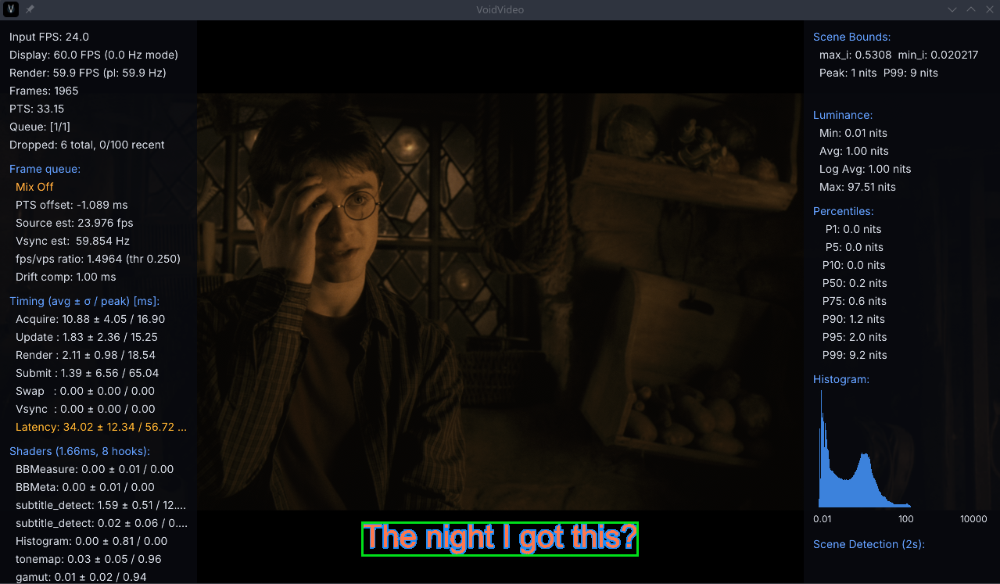

# VP-0070: Detect subtitle glyph regions for Alpha without OCR

## Status

Backlog. This is a detection-first renderer story. Its first usable outcome is
a truthful diagnostic overlay; it must not move, erase, redraw, OCR, or
otherwise modify subtitles until real-source geometry has been validated.

## User story

As a user of the Alpha renderer, I want VP to identify the glyph region and
subtitle capture area—even when captions are inside the picture or straddle a
black bar—so the renderer can first visualize and later protect or reposition
the subtitle region without requiring full text OCR.

## Context

VP-0010 is blocked on a strict OCR-based subtitle replacement approach. That
approach requires text recognition and source-panel reconstruction, which are
not necessary to solve subtitle-aware tone mapping or to establish whether a
subtitle is present. This story intentionally takes a different path: detect
glyph geometry and confidence, not the words.

Reference result from a comparable implementation:

The green box around the visible glyphs is the required first milestone. A
larger bounded capture/search area may also be shown in a visually distinct
diagnostic style. The result must work for subtitles wholly inside the picture,
wholly inside an encoded bar, and captions straddling the picture/bar boundary.

## Objective

Create a renderer-neutral subtitle-glyph-region contract and implement a
diagnostic Alpha path that publishes bounded glyph/capture rectangles with
confidence and temporal identity. Use the geometry initially for visual
verification and future tone-mapping protection only; do not perform OCR or
subtitle relocation in this story.

## Detection approach

Use a layered, latency-safe design:

1. A lightweight GPU or CPU prefilter identifies plausible subtitle search
   bands and candidate text regions from contrast, stroke-like structure,
   temporal behavior, and local background evidence.
2. An optional heavier region detector runs only on the bounded candidate area,
   not the full raster every frame.
3. If a neural detector is warranted, first evaluate existing detection-only
   models/runtimes that return text/glyph regions, masks, or quadrilaterals.
   Examples may include text-detection components from established OCR stacks,
   but recognition/OCR output must be disabled and ignored.
4. Training a VP-specific neural network is explicitly deferred until an
   evidence-backed benchmark proves existing models and non-neural detection
   insufficient.
5. Temporal tracking caches a stable region/capture area across repeated
   frames, invalidates it promptly on a cue transition, and avoids repeatedly
   invoking heavy detection for an unchanged cue.

The implementation must distinguish actual subtitle glyphs from menus, logos,
credits, scoreboards, receiver OSDs, and arbitrary in-picture text. Initial
diagnostics may show uncertain candidates, but they must label confidence and
must not affect output pixels.

## Geometry contract

Define a value-type result such as `SubtitleGlyphRegion` containing:

- source frame sequence and pipeline/renderer generation;
- raster dimensions and coordinate space;
- glyph bounding rectangle or mask bounds;
- bounded capture/search rectangle;
- confidence, stability, and detection source;
- whether the region is in picture, bar, or straddles the active-picture edge;
- temporal cue identity/fingerprint without recognized text; and
- detection timestamp/processing cost.

The result must be associated with the exact rendered frame generation. A
stale result must never be applied to a later source, renderer, display-mode,
HDR/SDR, or active-picture generation.

## First implementation milestone: green-box diagnostics

Add an opt-in Alpha diagnostic overlay that can render:

- a green rectangle tightly around the detected glyph region; and
- an optional differently styled rectangle around the capture/search area.

The overlay must be composited in the renderer’s visible picture coordinate
system, remain correct for normal and scope/CIH viewport profiles, account for
letterbox/pillarbox geometry, and never be confused with the normal VP OSD.
It must visibly state `unavailable`, `candidate`, or `stable` rather than
showing a misleading rectangle.

The first milestone is successful only when representative real content can be
captured and reviewed with the overlay. It must not erase/move/redraw captions,
change the tone map, or require a renderer restart to update the diagnostic.

## Latency and resource rules

- Detection must not add an unbounded queue, a mandatory frame hold, or a
  blocking GPU-to-CPU readback to the render/present path.
- If GPU compute is used, consume results asynchronously and skip/retain the
  last trusted diagnostic state rather than stalling presentation.
- A heavier model may run no more often than needed for cue changes and must
  operate on a bounded crop/downsampled representation.
- Record GPU/CPU detection cost separately from render/present cost.
- The low-latency Alpha objective in VP-0069 remains authoritative: subtitle
  detection must be demonstrably compatible with the selected low-latency
  configuration or be disabled with an explicit diagnostic reason.

## Tone-mapping handoff

Once the green-box diagnostic is trusted, publish geometry for a future
subtitle-aware tone-mapping or local-protection story. This story does not
change tone mapping itself. Its handoff must make clear whether the target is
the tight glyph region, the capture area, or a padded union of both, so a later
stage cannot accidentally protect arbitrary picture pixels.

## Validation

Build a representative corpus including:

- one-line and multi-line subtitles;
- captions entirely in black bars, entirely over picture, and straddling an
  active-picture edge;
- SDR, HDR, and LLDV-derived input;
- bright/dim subtitles, outlined text, opaque panels, and transparent styles;
- 23.976, 24, 50, 59.94, and 60 Hz content;
- dark scenes, high-black artwork, credits, menus, logos, scoreboards, and
  receiver/application overlays; and
- normal and scope/CIH viewport profiles.

For each capture, retain the diagnostic screenshot/video, logs, source
generation, active-picture geometry, candidate/stable state, and measured
detection cost. Measure false positives and false negatives before promoting
the result to a tone-mapping consumer.

## Acceptance criteria

- Alpha renders an opt-in green glyph-region box and optional capture-area box
  for stable detected subtitles on representative real content.
- Boxes remain correctly positioned for in-picture, bar-only, and
  picture/bar-straddling captions, including multi-line cues and scope/CIH
  profiles.
- The diagnostic truthfully reports unavailable/candidate/stable confidence and
  never applies a stale region to a later frame generation.
- The first implementation performs no OCR, text recognition, subtitle move,
  source erase, or subtitle redraw.
- No blocking GPU readback, renderer restart, sustained frame drop, queue
  growth, or measurable low-latency regression is introduced.
- Existing detection-only models and a non-neural baseline are benchmarked
  before considering custom neural-network training.
- A future tone-mapping consumer can subscribe to the documented geometry
  contract without duplicating detection or guessing coordinate spaces.

## Out of scope

OCR, cue transcription, subtitle replacement/relocation, training a custom
model, changing DirectShow `BASIC`, `ADVANCED`, or `BAR_OCR` behavior, and any
automatic tone-mapping change. VP-0010 remains tracked separately as the
blocked OCR/replacement work.

## Definition of done

The Alpha diagnostic overlay is validated on representative real captures,
its region contract and cost are documented, existing detector options have
been benchmarked, and there is an evidence-based decision on whether a later
subtitle-aware tone-mapping or movement story is worthwhile.
