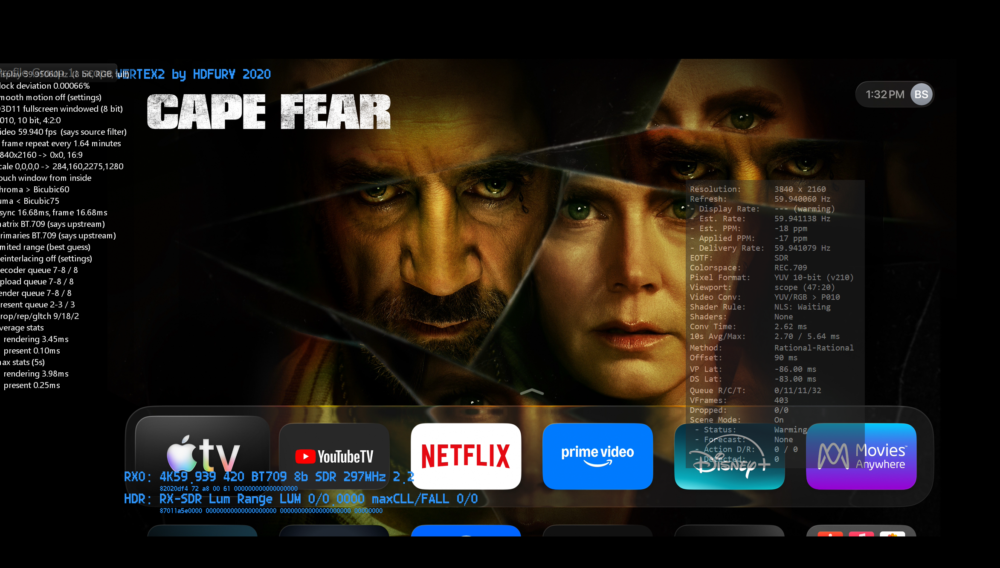

# VP-0062: NLS safe full-raster fallback for high-black UI and artwork

## Status

In progress (2026-07-29). This is a focused NLS detector/usability follow-up
to VP-0040, not a request to weaken trusted crop authority.

## Initial investigation

The deployed 59.940 Hz/3840x2160 log was inspected in
`C:\Videoprocessor\vp\logs\vp_debug.log` (13:32:16--13:32:29) and its
rotations. The high-black UI initially produced unpaired left/right dark-edge
candidates, correctly withheld as `classification=3` with the reason
`candidate lacks coherent opposing black-bar evidence`. At frame 736 the
detector published trusted full raster (`0,0-3840,2160`, aspect `1.7778`,
generation `2`) with `safe full-raster authority accepted`; NLS consumed that
same generation and engaged at 13:32:27 without a renderer restart. This
rules out a stale publication/consumer-generation failure for that reproduced
session. The original reference capture still needs a matched reproduction,
refresh-family coverage, and madVR/Alpha validation before deciding whether
any code change is warranted.

### Expert review outcome (2026-07-29)

The supplied Cape Fear screenshot matches the 13:32 deployed log session. NLS
was armed at 13:32:21 while the artwork generated asymmetric/unpaired dark-edge
candidates (`classification=3`); it published trusted full raster at 13:32:27
and madVR applied that same generation immediately, without a restart. The
issue is therefore visible warm-up latency (about six seconds after arming),
not a stale consumer or a safe crop being withheld indefinitely.

Any improvement must preserve three separate outcomes: trusted crop, trusted
full raster, and unavailable. Trusted crop still requires coherent opposing
bars. A faster full-raster path must instead require positive, spatially
distributed active-picture contact at the raster edge plus evidence that no
coherent opposing pair exists; it must never be a fixed-timeout fallback.
Fades, all-black, credits, overlays, and genuinely ambiguous material remain
unavailable with a specific OSD reason. Candidate validation must cover
23.976/24, 50, and 59.94/60 Hz, cold and transition arming, and both madVR and
Alpha, while logging first eligible evidence, decision latency, publication and
consumer generations, and renderer/queue/HDR health.

### Implementation progress (2026-07-29)

Implemented presentation hysteresis on branch
`codex/vp-0062-nls-geometry-deadband` (`ffaba48`), based on the current
default integration branch. Each typed NLS rule now owns
`stable_geometry_deadband_percent` (default `2`, accepted range `0`--`5`).
The transition model retains an already trusted rectangle only when every edge
and the aggregate active-size change remain within the configured percentage.
It never promotes provisional evidence, so dark artwork cannot gain crop
authority. A larger trusted change still takes the normal confirmation path.

The policy is applied by the selected madVR and Alpha NLS rules without a graph
or queue reset. Added transition tests for the 2% hold, a change beyond the
deadband, and the 5% maximum. All 268 unit tests passed; x64 Release solution
build completed successfully. The linker emitted existing PDB-debug-symbol
warnings only.

Deployed at 2026-07-29 14:21 EDT from that successful x64 Release build. The
installed `VideoProcessor.exe` and
`vprenderer\\VideoProcessorVPRenderer.dll` match their build artifacts by
SHA-256. Recoverable pre-deployment backups are
`C:\\Videoprocessor\\vp\\VideoProcessor.exe.pre-VP0062-20260729-142152.bak`
and
`C:\\Videoprocessor\\vp\\vprenderer\\VideoProcessorVPRenderer.dll.pre-VP0062-20260729-142152.bak`.
`C:\\Videoprocessor\\vp\\VideoProcessor.cfg` was deliberately left unchanged:
the per-rule default is compiled in as 2%. The application was not started as
part of deployment.

## User story

As a Scope-screen user with NLS armed, I want a sustained 16:9 full-raster
image containing large black or near-black UI/artwork regions to engage NLS
when safe, so it does not remain indefinitely at `NLS: Waiting` merely because
the image is visually dark.

## Field reference



The reference was captured on 2026-07-29 from an Apple TV/DeckLink/madVR path
at 3840x2160 and approximately 59.94 Hz. The OSD shows:

```text
Viewport: Scope (47:20)
Shader Rule: NLS: Waiting
Shaders: None
```

The source is a full-raster 16:9 Apple TV interface/background with large
black or near-black areas, title artwork, and UI overlays. It is not evidence
that a symmetric encoded Scope crop is present. The desired outcome must be
decided from reliable active-picture evidence, not from the amount of black
alone.

The tracked asset is
`stories/assets/VP-0062_nls-waiting-high-black-apple-tv-cape-fear.png`
(SHA-256 `34BE423C1B842CCB1B2BD9FECFAB668FC3E3F0A05B033DE68FEA33A37BD218D9`).
It is a regression reference only; do not treat its composited madVR/VP OSD
pixels as input-video pixels.

## Why this is a follow-up, not a duplicate

VP-0040 correctly tightened crop authority after dark Apple TV artwork had
been falsely promoted to a crop, causing destructive edge loss. The safer
classification can now leave NLS in `Waiting` when it cannot affirm a crop.
This story must preserve VP-0040's primary rule: weak, repeated, or merely
dark evidence must never gain crop authority. It addresses the separate
usability question of when an uncertain candidate can safely resolve to a
full-raster 16:9 treatment rather than remaining indefinitely unavailable.

## Required investigation

1. Obtain the corresponding deployed log excerpts from
   `C:\Videoprocessor\vp\logs\vp_debug.log` or a numbered rotation. Record
   active-picture classification, candidate/stable bounds, per-edge evidence,
   confidence, contradictions, raster size, detector generation, NLS mapping
   reason, and elapsed time in `Waiting`.
2. Reproduce with the reference-style Apple TV UI at 59.94/60 and with the
   same UI at another supported refresh family where available.
3. Determine whether the detector has:
   - a genuinely ambiguous crop candidate;
   - an unpaired top/bottom/side near-black region;
   - a full-raster candidate withheld because one edge lacks evidence; or
   - stale/missing detector publication or shader-refresh consumption.
4. Compare with controls that must remain safe:
   - genuine 2.35:1/2.40:1 encoded letterbox content;
   - true 4:3/pillarboxed content;
   - a dark movie scene with no bars;
   - fades/all-black frames and credits;
   - subtitles, title cards, logos, and app overlays near black bars;
   - fixed 16:9 sports or broadcast content.
5. Establish whether this is renderer-neutral. Validate the detection model
   once, then exercise at least madVR and Alpha consumption paths if they both
   consume the same active-picture publication.

## Required behavior

1. NLS must continue to require affirmative, coherent opposing-edge evidence
   before it crops or treats a source as an encoded Scope/pillarbox rectangle.
   Temporal repetition alone cannot promote a dark region to crop authority.
2. When sustained evidence positively rules out a coherent crop, or when a
   bounded ambiguity policy can safely choose full raster, publish an explicit
   trusted full-raster result and allow the armed NLS mapping to engage.
3. Do not blindly declare full raster after a fixed timeout. A genuine
   letterboxed/pillarboxed source still needs time to prove its opposing bars.
   The decision must use the existing edge texture, chroma, continuity,
   boundary, symmetry, contradiction, and temporal evidence model.
4. The detector must not permanently preserve `Waiting` once it has enough
   safe full-raster evidence. Define and log a bounded decision latency for
   this case, normalized across 23.976/24, 50, and 59.94/60 Hz.
5. If evidence remains truly unavailable (for example startup black, a fade,
   or a mode transition), retain the current safe presentation and say why.
   The OSD must distinguish `Waiting for trusted picture geometry` from a
   generic `Waiting` state, with a concise reason such as `ambiguous dark
   edges`, `awaiting opposing-bar evidence`, or `no stable frame yet`.
6. Mapping changes must remain restart-free after NLS is armed. Do not reset
   queues, rebuild the graph, change HDR state, or introduce a renderer restart
   to resolve detector uncertainty.

## Candidate directions to evaluate

- A fail-safe full-raster authority path that requires enough positive evidence
  that no *paired* crop exists, rather than treating absence of crop proof as
  permanent unavailability.
- Separate confidence for `trusted crop`, `trusted full raster`, and
  `unavailable`; do not collapse them into one scalar threshold.
- A detector-publication/consumer diagnostic if the model reaches trusted full
  raster but NLS remains Waiting due to a generation or shader-refresh gap.
- A low-cost, bounded recheck after the UI/artwork persists, without raising
  per-frame 4K analysis cost or lowering VP-0040's crop safety thresholds.

These are hypotheses, not authorized fixes. Select the smallest evidence-led
change that preserves the safety contract.

## Validation matrix

| Case | Required result |
| --- | --- |
| Reference-style high-black full-raster Apple TV UI | Bounded transition from Waiting to trusted full-raster NLS mapping, or a precise logged reason why the frame remains unavailable |
| Bright full-raster 16:9 UI/content | Existing correct NLS behavior remains prompt |
| Genuine Scope movie | Trusted crop/passthrough remains correct; no erroneous 16:9 stretch |
| Genuine 4:3 source | Correct NLS mapping without crop loss |
| Dark full-raster movie scene | No false crop, oscillation, or indefinite stale geometry |
| Fade, black frame, subtitle, credit, logo, overlay | No false crop or destructive mapping; reason is observable |
| Mixed Scope/IMAX movie | VP-0034/0035 transition behavior remains restart-free and correct |
| madVR and Alpha where applicable | Same trusted geometry is consumed without queue, reset, HDR, or stale-frame regression |

## Acceptance criteria

- The reported high-black UI/artwork case is reproducible with logs and either
  safely engages trusted full-raster NLS within a documented bound or exposes
  a specific remaining evidence gap.
- No dark-artwork, subtitle, fade, credit, or overlay scenario regresses into
  a false crop or lost source pixels.
- `NLS: Waiting` has actionable, concise OSD/log reasoning and cannot hide a
  stale consumer-generation or refresh failure.
- No renderer restart, graph reset, queue instability, dropped-frame burst,
  HDR-state error, or material 4K detector performance regression is added.

## References

- VP-0040: Trusted active-picture detection and stable NLS engagement
- VP-0034/VP-0035: Restart-free mixed-aspect NLS and robust transitions
- `src\VideoProcessor-Lib\microsoft_directshow\live_source_filter\CBufferedLiveSourceVideoOutputPin.*`
- `src\VideoProcessor-Lib\ActivePictureTransitionModel.*`
- `src\VideoProcessor-Lib\P010ActivePictureEvidence.*`
- `src\VideoProcessor-Lib\microsoft_directshow\MadVRShaderLoader.*`
